软件发展史
IBM把软件分为四大类：系统软件、编程软件、应用软件、嵌入式软件，我们日常所说的软件，大多是指可帮助用户执行任务的应用软件。从软件开发技术热度及兴起时间回顾应用软件的发展史，大致如下图所示：

image.png
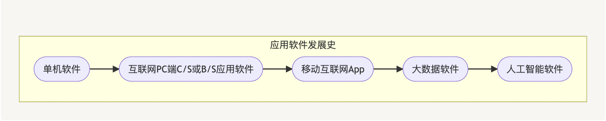

不难看出应用软件的革新是人类对高效率和智能化的追求过程。

## 需求&技术&数据关系
除了人的需求推动软件技术不断进步外，还有另外一只手逼着人类对技术推陈出新，那就是人类社会产生数据的速度。 互联网数据中心（IDC）出台的《2021-2025年全球数据展望报告》中指出：”在过去11年内，数据的增长几乎翻了40倍，并且预计未来3年的数据产量将超出过去30年的总和。在2010年，全球生成、复制和消费的数字数据总量约为2ZB，而在2020年增至64.2ZB，2021年估计为79ZB，2022年估计为97ZB，并在2025年增加至181ZB。“

这种产生数据的速度提高，又是由于技术提高所带来的必然结果，比如：从PC时代到移动互联网时代，随着软硬件技术提高，每个人持有的电子产品终端数量增多、使用的软件种类和数量都在提高、使用终端的时长也在增多。根据国际电信联盟（ITU）公布的数据，在2021年，移动电话用户超过了83亿，而在同一年，互联网用户超过了50亿。

同时，产生数据的量和产生数据的速度提高，反过来又对处理数据的技术又提出了更高要求，比如：最初数据量小时，可能只用一个关系型数据库或者在备份库做分析就能满足包括分析需求在内的所有业务需求，后来数据量再大，发展分库分表技术可以解决数据存储，但是就不适合大量join分析查询了，再后来就不得不单独独立出一个软件开发分支——大数据开发，来专门应对海量数据存储计算分析的需求了。

可以看出，以传统关系型数据库为支撑的联机事务处理 OLTP(On-line transaction processing)软件系统在更大的数据量和更高要求的数据分析需求面前，渐渐清晰了它的职责上边界。随着对大量OLTP系统积累的业务数据进行分析产生的价值越来越大，加上大数据技术和理论的发展，联机分析处理 OLAP(On-Line Analytical Processing)软件系统在大数据时代有了新解决方案——数据仓库（Data Warehouse）。

值得澄清的一个误解是，OLAP相关软件发展其实并不晚，只是随着时代和技术的进步，有了新的解决方案而已。比如：上世纪80年代，电子表格是OLAP中的主要应用软件，1989年SQL发明后，在90年代有了基于数据库的OLAP应用。当然我们在当下的日常项目讨论中，常常都是狭义的指代，OLTP就是Web类购物网站、支付系统等记录用户行为的软件系统，OLAP就是数仓。

## OLTP系统 VS OLAP系统
OLTP和OLAP是从不同需求出发，设计的不同系统对数据的不同加工方式，也是当前对数据处理的主要两大类系统，从我们常参与的项目中也能感受到。OLTP 是传统的关系型数据库的主要应用，主要是基本的、日常的事务处理。OLAP 是数据仓库系统的主要应用，支持复杂的分析操作，侧重决策支持，并且提供直观易懂的查询结果。

image.png
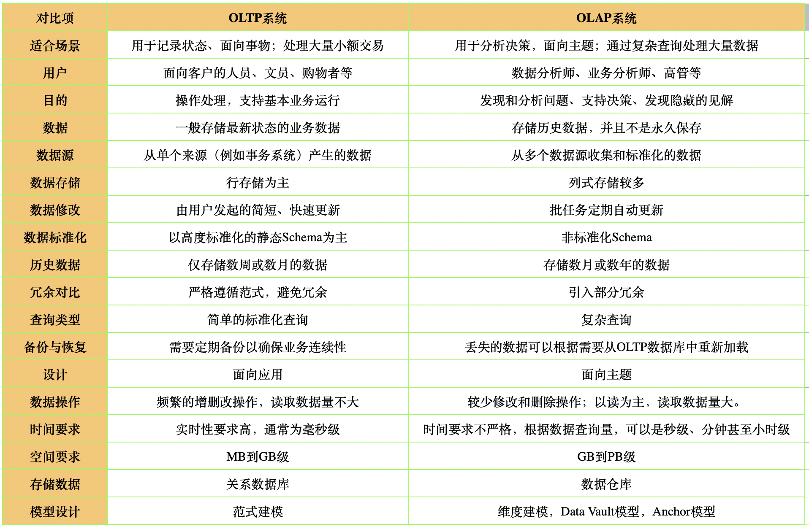

## 数据仓库的定义
随着越来越多、各色各样的OLTP系统被开发使用，产生了大量的业务数据和应用日志文件，这些业务数据位于不同的数据源中，是一个个数据孤岛。加上直接在OLTP系统中进行太多的分析，势必加重业务系统的负载，危及业务运行。从企业的角度看，必须在访问性能、存储计算成本、使用效率和数据质量之间找到最佳平衡点，能够集中、整合多个来源的大量数据，为企业提供一个“单一信息源”查询和分析，这也就是数据仓库（DataWarehouse）最朴实的定义。

数据仓库广义定义：数据管理、存储、计算、建模的方法论，是一种过程处理方法；它是面向主题的、集成的、稳定的、反映历史变化的；它由元数据、数据建模、实现代码、血缘关系、规范准则组成；

从下图可以看出，数据仓库在整个数据体系中的位置：数据采集->数据接入->数据仓库->数据报表/数据分析/数据挖掘。

早期大数据没有发展起来时，给企业做BI报表（Business Intelligence商业智能），主要是基于Oracle体系。后来随着企业数字化、互联网崛起，企业收集到数据量剧增，原有技术框架已经满足不了业务存储和分析的需求，于是乎就逐渐发展成现在以Hadoop生态为主的数据仓库。

数据仓库本质是从数据库衍生出来的，所以数据仓库的建模也是不断衍生发展的。从最早的借鉴数据库的范式建模，到逐渐提出维度建模，Data Vault模型，Anchor模型等等，越往后建模的要求越高。但是对于数据仓库来说，目前主流还是维度建模，会夹杂着范式建模。

image.png
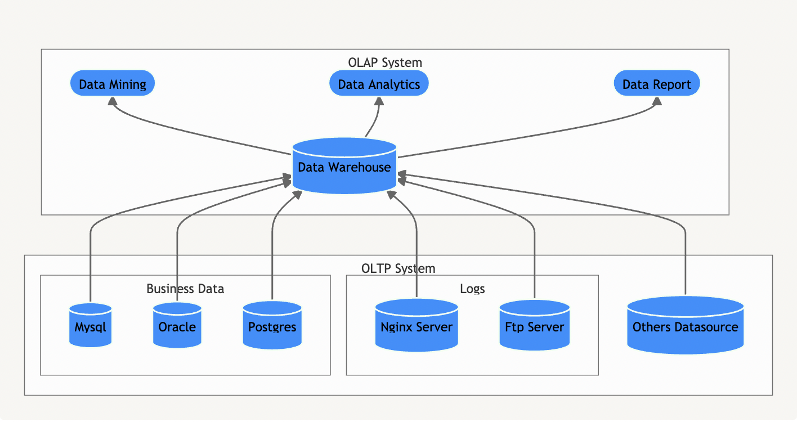

## 什么是建模
image.png
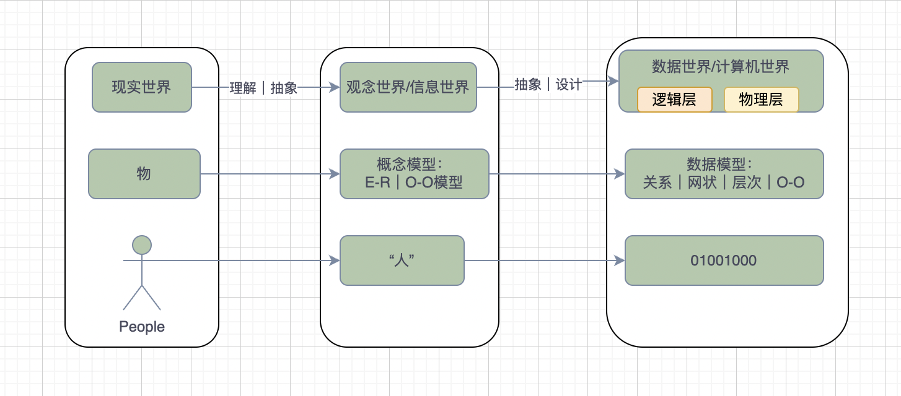

没有计算机之前，可能从哲学的角度看，只有现实的世界和我大脑中的世界。尤其互联网发明后，可能又多了一个世界，它们之间的关系可以用上图简单阐述吧。

现实世界就是我们生活和感受到的物质世界，信息世界是对现实世界的理解与抽象，而计算机世界则是再对信息世界的抽象和设计；

表达信息世界的模型我们一般称**概念模型，**概念模型能够表征信息本质联系的概念表达。

表达计算机世界的模型我们一般称**数据模型，**数据模型相对来说更适合人类阅读习惯的信息表达；

可以看到我们人类认识世界的过程，就是不断地抽象，也就是不断建模的过程，这也和建模的定义不谋而合：“建模，就是建立模型，就是为了理解事物而对事物做出的一种抽象，是对事物的一种无歧义的书面描述。”

而抽象又是什么呢？抽象是理解-区分-命名-表达的过程，理解的标志是区分，而区分的标志是命名，抽象的最终结果是正确的表达。

抽象的意义还在于可以将可无限扩展的内容，或内容暂无法枚举的情况，抽象为可有限描述的概念。这点对于人类和计算机认识、存储事物有极大意义，比如：我们给小孩解释什么是动物，我们不可能将所有动物带到小孩的面前指给他看，这时如果抽象为能自主运动和食有机物叫动物，那么其实就认识了动物。同样在虚拟世界的数据库中要存储动物，我们建了一张“animal”的数据库表，每行数据是一种动物，将无法穷尽的“型”转换成了“值”。

## 数据建模的分类
关系型数据库中的范式建模是针对具体的业务流程的实体对象关系抽象；数据仓库中的范式建模是站在企业角度面向主题的抽象，它借鉴了关系型数据库中的范式建模，但是有所不同。本文讨论的范式建模是关系型数据库中的范式建模，而不是数据仓库中的范式建模。

image.png
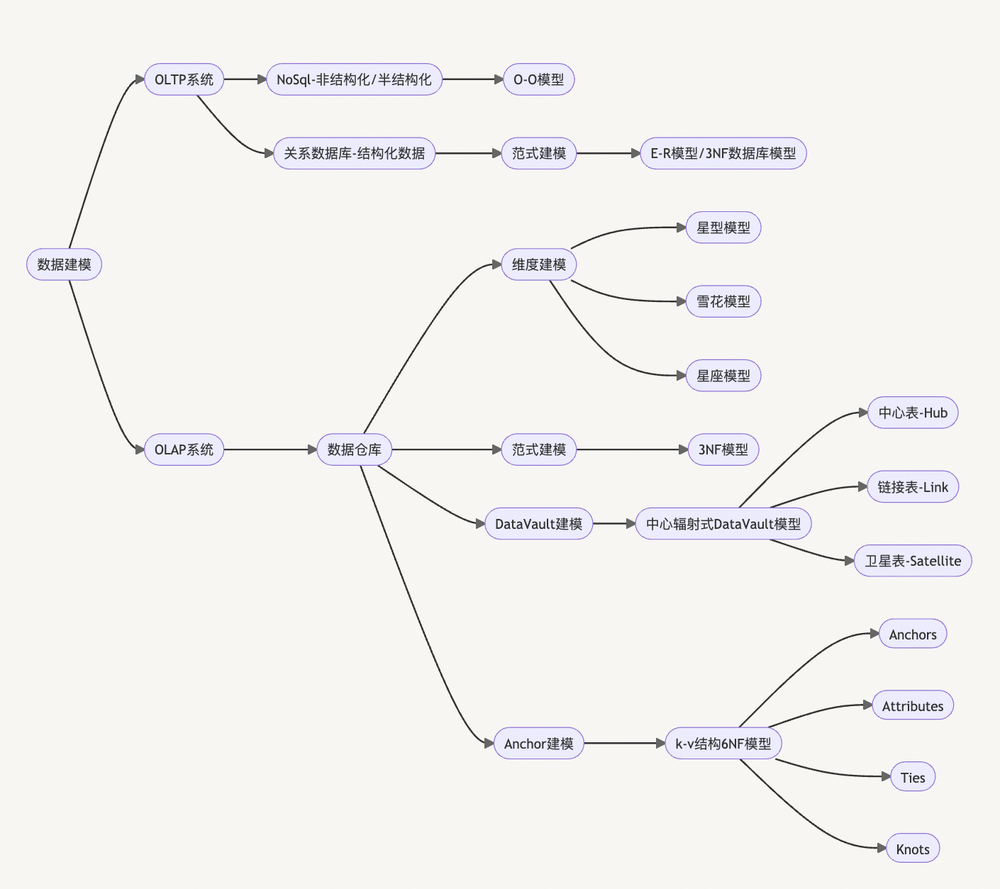

## 关系型数据库-范式建模
将现实世界的物抽象为具备属性的不同主体, 并且不同主体之间通过关系相联，将主体、关系、属性用E-R关系图表示，这种建模过程俗称E-R建模；

一般我们还需要再把E-R模型映射得出数据库模型，且得到的数据库模型必须满足三范式(3NF)，我姑且把这一系列建模过程叫范式建模，目的是为了比较全的涵盖我们基于关系型数据库开发OLTP系统时的整个数据建模过程。

image.png
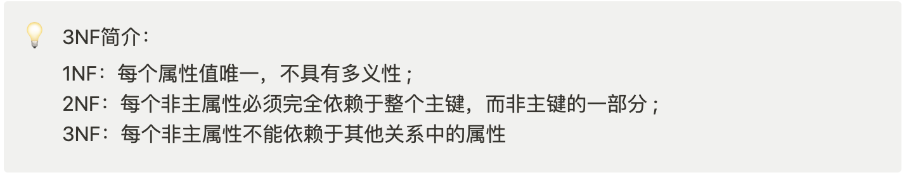

### 范式建模的步骤：

image.png
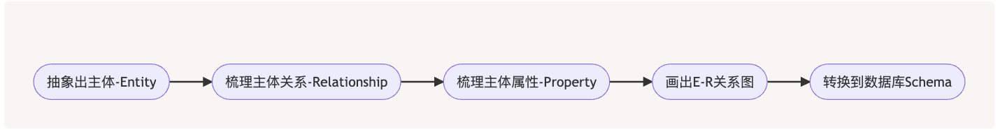

主体:是指发生业务关系的对象，比如：教师，课程，学生
属性:是对主体的说明和刻画。比如：教师的属性可以是教师名称，性别，学历等。
关系:比如：一个老师可以教多门课，一门课可以被多个老师教
以一个购物业务(customer买不同Product生成order)过程建模演示.

Step1: 分析业务需求，抽象出此需求的主体有：customer，product，order；

Step2: 梳理出主体的属性如下图

image.png
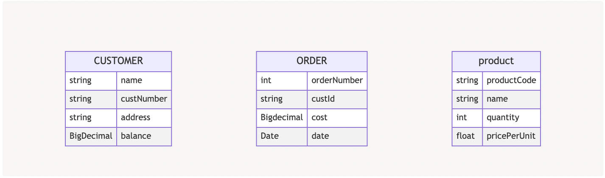

Step3: 梳理主体之间的关系

customer和order 之间必然存在这个下订单的关系，且存在着“一个顾客至少有0个、最多不限个订单，一个订单最少有1个顾客、最多也有1个顾客”的约束关系；

order和商品之间也存在着包含关系，且存在着“一个订单至少包含1件某种商品，某种商品在0个订单或者无数订单中被购买”的关系。

Step4: 画出E-R关系图

image.png
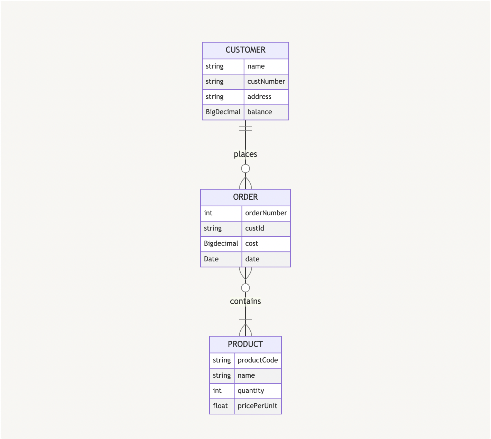

Step5: 转换到数据库Schema

E-R图转换为数据库Schema或者说数据库模型主要遵循以下心法：

E-R中实体→数据库的表格 (table) ，

实体的属性→表中的属性.

E-R图中实线关系→外键或关联表表示。（多对多关系不能被直接转换, 需要构造关联表，如下图中的order_product表）.

image.png
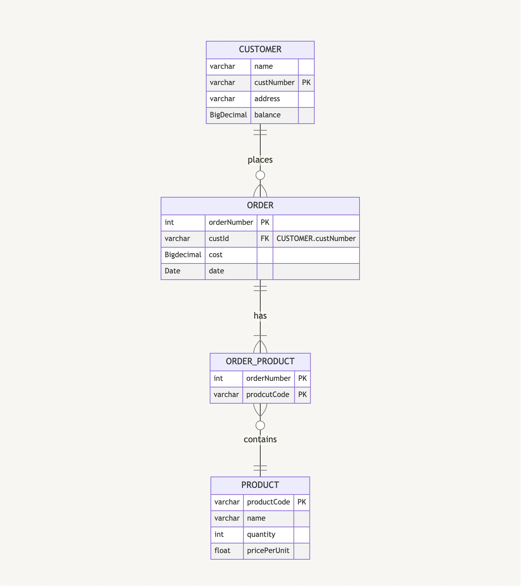

## 数据仓库-维度建模
维度建模，是数据仓库大师Ralph Kimball提出的，是目前数据仓库建模中最常用的。维度建模以分析决策的需求为出发点，构建的数据模型是为了满足用户快速完成分析需求，同时还有较好的大规模复杂查询的响应性能。维度建模的主旨思想是把数据仓库中的表划分为事实表、维度表两种类型，而建模的目的就是从需求中抽象出这2种表。

### 维度建模步骤如下：

image.png

选择业务过程：

 业务过程指企业的业务活动事件，比如下单、支付、退款都是业务过程 ；业务过程是一个不可拆分的行为事件。
声明粒度：

 粒度用于确定某一事实表中的行表示什么，比如：是一条订单信息，还是一天的订单，或者是一周的订单。 
识别维度(描述)：

 维度提供围绕某一业务过程事件所涉及的"谁、什么、何处、何时、为什么、如何"等背景。维度表包含分析应用所需要的用于过滤及分类事实的描述性属性。从语义分析，维度就是修饰事实的定语，比如：这是个帅气的男人，帅气就成了评价男人的一个维度，维度值可以是大帅，中帅，小帅。
确认事实(度量)：

  事实是对业务过程事件的度量，基本上都是以数据值表示，次数、个数、件数、金额，也可以进行累加。一个事实表行与按照事实表粒度描述的度量事件之间存在一对一关系，因此事实表对应一个物理可观察的事件。在事实表内，所有事实只允许与声明的粒度保持一致。
继续以电商购物业务(customer买不同Product生成order)场景建模演示。由于维度建模以分析决策的需求为出发点，所以我们提出需求：提供每天卖出数量最多的产品top 10

Step1: 选择业务过程

统计卖出数量最多的产品，自然而然选择下订单的业务过程；

Step2:粒度

在OLTP系统中，一个订单中可能包含购买的多种商品，而我们要统计的是卖出每种产品的数量，所以我们要把原来每笔订单拆分为产品的订单（或者直接从订单详情表中转化），这样就得到了订单详情事实表。订单详情事实表中一行数据表示的是一条订单中的一个商品项，这就是它的粒度；

Step3:识别维度

需求中是统计每天的销售产品top10，“每天”告诉了我们要有时间维度，而且在维度建模中，时间是一种特殊的维度，基本在所有维度建模中都需要存在；产品是另外一种维度；

Step4:标识事实

需求中要销售数量的top10， 所以度量值必须要有销售数量。

最终维度建模得出的星型模型图如下：

image.png
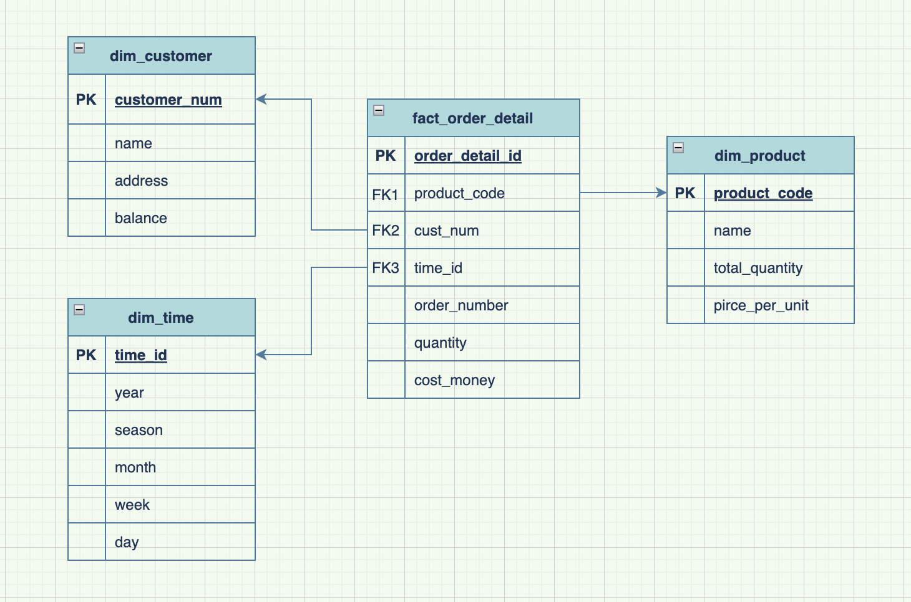

值得注意的是，在数据仓库的各层模型中，只有DIM层和DWD层需借助维度建模构建，DWS层、DWT层和ADS层都是以需求为驱动，和维度建模已经没有关系了。DWS和DWT都是建宽表，按照主题去建表。

image.png
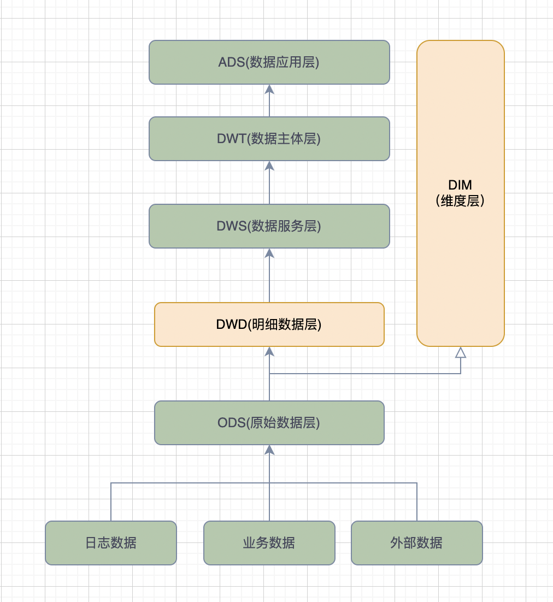

## OLTP范式建模 VS OLAP维度建模
总结下基于关系型数据库的范式建模和数据仓库的维度建模的不同：

image.png
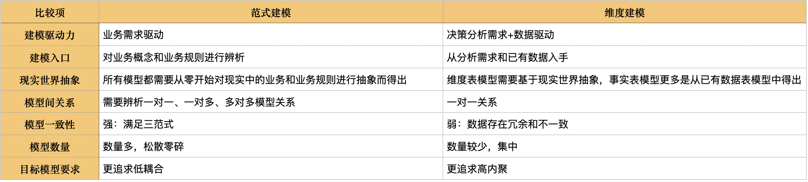

